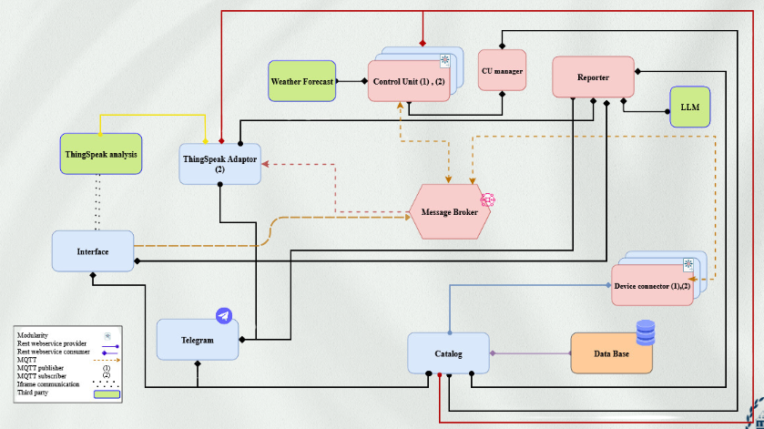

# Smart Care Project

## Overview
The **Smart Care** project is a modular IoT ecosystem designed for real-time monitoring and control of plant environments. The system integrates multiple services, ensuring robust interaction among components for sensor data collection, analysis, and automated actuator responses. 

### Key Features:
- **Device Registration and Management**: Handles the registration of devices, sensors, and plants.
- **Real-time Monitoring**: Sensors provide live data such as temperature, light intensity, and soil moisture.
- **Automated Controls**: Actuators adjust environmental parameters based on sensor data.
- **User Interaction**: Users can view reports, track plants, and adjust settings via a web interface or a Telegram bot.

---

## Architecture


The system consists of the following components:

### Microservices
1. **Registry**: Manages plant, device, and room data registration.
2. **Adaptor**: Integrates sensors and actuators, publishing collected data and managing ThingSpeak channels.
3. **Device Connector**: Handles MQTT messaging and links devices with the system.
4. **Reporter**: Provides comprehensive reports based on collected sensor data.
5. **Control Unit**: Manages automated actions based on sensor readings.
6. **CU Manager**: Manages the lifecycle of control unit containers dynamically.
7. **Telegram Bot**: Enables user interaction for plant management via Telegram.
8. **Web Service**: Offers a Flask-based user interface for managing plants and devices.

---

## Installation

### Prerequisites
- Docker
- Python 3.9+

### Steps
1. Clone the repository:
   ```bash
   git clone https://gitlab.com/danikhalang/smart_care.git
   cd smart_care
   ```

2. Set up environment variables:
   Create a `.env` file for every Microservice.

3. Build the controller image:
   ```bash
   cd control_unit
   docker build -t controller_image .
   ```

4. Start services with Docker Compose:
   ```bash
   docker-compose up -d
   ```

---

## Usage

### Web Interface
Access the web interface at `http://localhost:5000` to view plant details, sensor data, and control devices.

### Telegram Bot
1. Start the bot by sending `/start`.
2. Use `/menu` to view available actions.

### Data Structure documentation
Refer to the [documentation](https://vivacious-cabbage-5cb.notion.site/Structures-1422a257bf7680118b8ff273a1d3a598) for detailed examples of all available data structures.

---

## Development

### Directory Structure
- `adaptor.py`: Connects the system to ThingSpeak (receive MQTT messages and write on thingspeak RESTfully).
- `control_unit.py`: Manages control actions based on sensor inputs.
- `cu_manager.py`: Dynamically manages control unit containers.
- `interface.py`: Provides a Flask-based front-end interface.
- `telegram_bot.py`: Enables user interaction for plant monitoring via Telegram.
- `registry.py`: Registers and retrieves device and plant data.
- `device_connector.py`: Maintains device communication.
- `reporter.py`: Generates detailed reports on plant conditions.

---

## Future Enhancements
- Extend compatibility to more sensor and actuator types.
- Develop predictive analytics for plant health monitoring.

## Contributions
Contributions are welcome! Please fork the repository, make changes, and submit a pull request.


